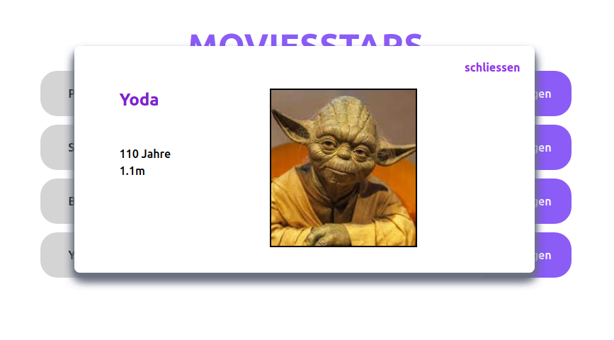

# React + TypeScript + Tailwindcss + Vite

- EN

## Movie-Stars

- Task "MovieStars":

  The goal of this task is to set up a React project using Vite and Tailwind, incorporating ;various concepts such as hooks, props, components, onClick events, and array functions. The design should be responsive and implemented using Tailwind CSS. The application should display an overview of all MovieStars from a predefined array, with each MovieStar opening a modal upon clicking a button.

This task provides a comprehensive application of concepts learned so far in React. Ensure to write clear and structured code to ensure a well-maintained and functioning application.

## 

---

- GE

## Movie-Stars

- Aufgabe "MovieStars":

  Ziel dieser Aufgabe ist es, ein React-Projekt mit Vite und Tailwind aufzusetzen und dabei verschiedene Konzepte wie Hooks, Props, Components, onClick-Events und Array-Funktionen zu nutzen. Das Design soll responsive sein und mithilfe von Tailwind CSS umgesetzt werden. Die Anwendung soll eine Übersicht aller MovieStars aus einem vordefinierten Array anzeigen, wobei jedes MovieStar durch Klick auf einen Button ein Modal öffnet.

Diese Aufgabe bietet eine umfassende Anwendung der bisher erlernten Konzepte in React. Achte darauf, klaren und strukturierten Code zu schreiben, um eine gut wartbare und funktionierende Anwendung zu gewährleisten.

## Run the project ?

Type in command: npm run dev

###Created by Tomas Matusek
